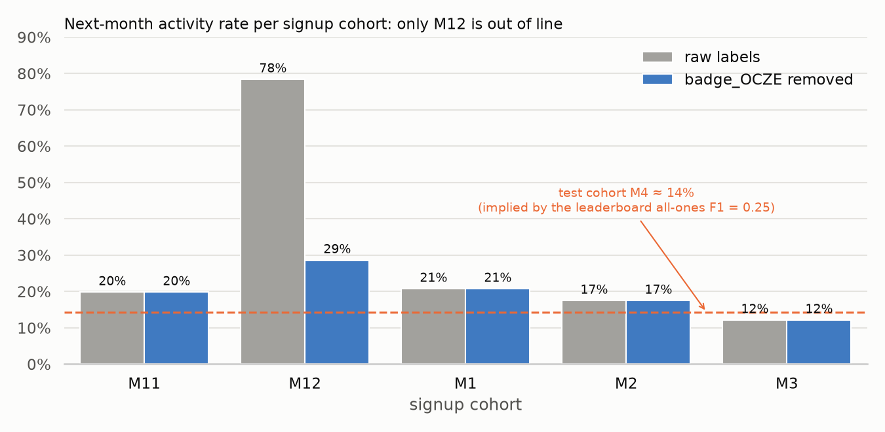
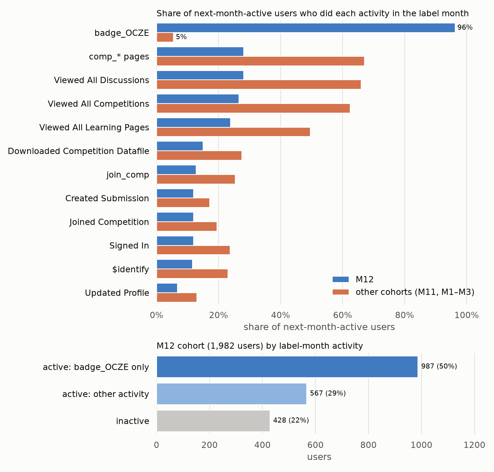
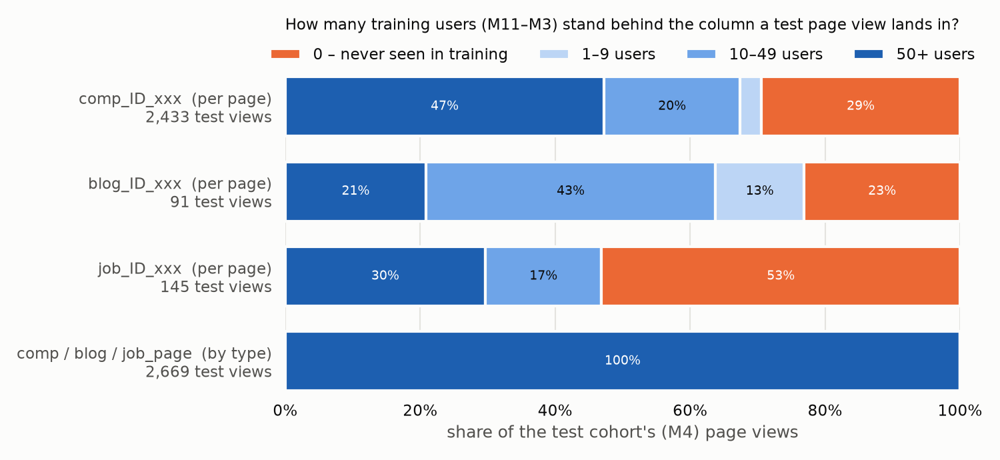
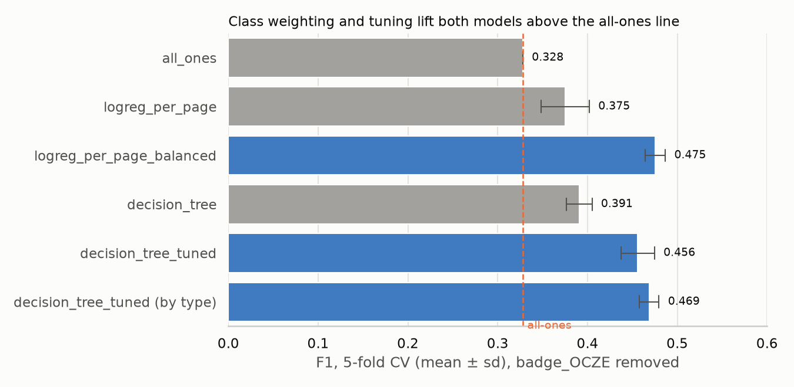

# 新用户次月活跃预测：实验报告

2026-10-06

**摘要。** 本报告整理了截至目前的四项改进。

1. 定位并修复了标签污染问题：一条名为 `badge_OCZE` 的记录让 M12 注册用户的"次月活跃率"从约 29% 被抬高到 78%。
2. 用类别加权缓解了 1:4 的正负样本不平衡。
3. 用超参数搜索解决了决策树的过拟合。
4. 把具体页面列改为按页面类别计数，让特征能推广到新的月份。

在修复后的数据上，表现最好的两个模型是加权逻辑回归（F1 = 0.475）和调参后、按类别构造特征的决策树（F1 = 0.469）。两者都明显超过了 all-ones 基线（0.328）。

---

## 1. 背景与实验设置

**任务。** Zindi「新用户次月活跃预测」：根据新用户注册当月的行为，预测他在注册后的下一个月是否活跃。官方指标是正类（Active = 1）的 F1，提交的是 0/1 硬标签。

**数据。** 共 12,413 个用户。注册月份经过脱敏，按时间先后依次为 11 → 12 → 1 → 2 → 3 → 4 → 5。下文用 M11、M12 等表示"在该月注册的用户"。需要提交预测的是 M4 注册的 1,340 个用户。

**标签 Y。** 用户在注册后的下一个月，只要在点击日志、比赛报名、发帖、评论四张表中有任意一条记录，就记为 1，否则记为 0。M4 的标签被比赛方隐藏；M5 没有下一个月的数据，因此没有标签。所以有标签的是 M11–M3 注册的 9,026 个用户。

**特征 X。** 只使用注册当月的事件，包括两部分：

- Users.csv 中的 5 列画像：FeatureX、FeatureY、国家、注册日、注册小时；
- 每种行为一列，值是该行为在注册当月发生的次数。比赛页、博客页这类具体页面，每个页面编号单独占一列。

**评估方式。**

| 项目 | 设置 |
|---|---|
| 内部评估 | 有标签用户按用户随机切成 5 折（按标签分层，seed = 42），所有模型使用同一套切分，报告 F1 的均值 ± 标准差 |
| 外部评估 | 官方 leaderboard，在 M4 用户上计算 |
| 判定阈值 | 模型输出的概率 ≥ 0.5 时判为 1，所有实验都不调阈值 |

全部预测为 1（all-ones）时，召回率等于 1，精确率等于正样本比例 p，所以 F1 只由 p 决定：

F1(all-ones) = 2p / (1 + p)，反过来 p = F1 / (2 − F1)

利用这个关系，可以从 all-ones 的分数反推出数据中的正样本比例。第 2 节就是用它来发现问题的。

---

## 2. 起点：内部评估和 leaderboard 不一致

最初的设置使用原始数据，没有任何处理。结果如下：

| 模型 | 5 折交叉验证 F1 | leaderboard F1 |
|---|---|---|
| all-ones | 0.468 | 0.25 |
| 逻辑回归 | 0.677 ± 0.019 | 低于 all-ones |

这里有两个异常：

1. **all-ones 的分数从 0.468 掉到了 0.25。** 按上面的公式反推，有标签数据的正样本比例是 0.305，而测试集只有约 0.143，相差一倍多。all-ones 不依赖任何特征，所以这个差距只能来自**标签的分布**本身。
2. **逻辑回归在交叉验证中远好于 all-ones，在 leaderboard 上却更差。** 它只把 1,340 个测试用户中的 47 人（3.5%）预测为活跃，而测试集真实的活跃比例约为 14%。

由此提出后面几节要检验的假设：

| 编号 | 假设 | 对应的现象 |
|---|---|---|
| H1 | 训练标签中有一部分被异常抬高了 | 异常 1 |
| H2 | 正负样本不平衡，加上 0.5 的阈值，让模型过于保守 | 异常 2 |
| H3 | 不限深度的决策树会过拟合 | 换成树模型后的新问题 |
| H4 | 按页面编号构造的特征无法推广到新的月份 | 测试月出现了新比赛、新博客 |

---

## 3. H1：M12 的标签被 `badge_OCZE` 污染

### 3.1 先定位到哪个月

把有标签的数据按注册月拆开，看每个月的"次月活跃率"：

*图 1：各注册月的次月活跃率。灰色是原始标签，蓝色是去掉 `badge_OCZE` 之后的标签。橙色虚线是从 leaderboard 反推出的测试集活跃率。*

**解读。** 看灰色柱子：M11、M1、M2、M3 都在 12%–21% 之间，测试集的约 14% 也落在这个范围内，只有 **M12 高达 78%**。因此第 2 节中整体正样本比例偏高（0.305），主要来自 M12 这一个月。

### 3.2 再定位到哪种行为

M12 用户的"下一个月"是 M1。我们统计了在 M1 被判为活跃的 M12 用户各做了哪些事，并与其他月份的活跃用户做对比：

*图 2：上图是"下个月活跃"的用户中，在标签月做过每种行为的比例（蓝色为 M12，橙色为其他月份）。下图是 M12 全部 1,982 个用户按标签月的行为拆分。*

**解读。**

- 只有 `badge_OCZE` 一项明显异常：M12 的活跃用户中有 **96%** 有这条记录，其他月份只有 **5%**。
- 真实的使用行为（浏览比赛、浏览讨论、下载数据、提交、登录），M12 反而都只有其他月份的一半左右。
- 下图显示，M12 中有 **987 人（50%）在下一个月只有这一条记录**，没有任何其他行为。
- 这条记录集中出现在 M1 的第 15 天，当天有 3,005 个用户同时获得。这种分布不像用户的主动行为，更像系统批量发放的徽章（这一点是推断，官方没有说明）。

### 3.3 修复与验证

**修复。** 在读取数据时，直接删除 UserActivity.csv 中 `Title = badge_OCZE` 的 8,864 行。这样 X 和 Y 都不再受它影响。

**验证。** 如果 H1 成立，删除这条记录后，M12 应该回到正常水平，而其他月份不受影响。

| 指标 | 修复前 | 修复后 |
|---|---|---|
| M12 次月活跃率 | 78.4% | **28.6%** |
| 其他月份次月活跃率 | 12%–21% | 不变 |
| 整体正样本比例 | 0.305 | 0.196 |
| all-ones 交叉验证 F1 | 0.468 | 0.328 |
| 逻辑回归交叉验证 F1 | 0.677 | 0.375 |

**结论。** H1 成立。M12 回到了和其他月份相近的水平（图 1 中的蓝色柱子）。all-ones 的交叉验证分数也向 leaderboard 的 0.25 靠近了。

逻辑回归从 0.677 降到 0.375，说明之前的高分有很大一部分来自"认出 M12 用户"，而不是真正学到了用户行为。**之后所有实验都在修复后的数据上进行。**

---

## 4. H2：正负样本 1:4，让模型预测"活跃"太少

**现象。** 修复后，正样本有 1,770 个，占 19.6%，正负比约为 1:4。逻辑回归在测试集上给出的平均概率只有约 0.12，能超过 0.5 的人很少：它只把 51 人（3.8%）预测为活跃，而真实比例约为 14%。

F1 对漏掉正样本的惩罚很重。比如测试集真有约 190 个活跃用户时，即使这 51 个预测全部正确，召回率也只有约 27%。

**实验。** 只改一处：给逻辑回归设置 `class_weight="balanced"`。训练时每个正样本的权重约为负样本的 4 倍。阈值仍然是 0.5，其余设置全部不变。

| 模型 | 交叉验证 F1 | 测试集预测为活跃的人数 |
|---|---|---|
| 逻辑回归 | 0.375 ± 0.027 | 51（3.8%） |
| 逻辑回归 + 类别加权 | **0.475 ± 0.011** | 137（10.2%） |

**结论。** H2 成立。加权之后，模型敢于预测更多人活跃，预测比例从 3.8% 提高到 10.2%，更接近真实的约 14%。F1 提高了 0.10，远大于各折之间的波动（标准差约 0.01–0.03）。

---

## 5. H3：默认决策树严重过拟合

**现象。** sklearn 默认的决策树不限制深度。每一折训练出来的树深度达到 46–63 层，约有 1,400 片叶子，训练集 F1 是 0.995，验证集 F1 只有 0.391。

**实验。** 在 216 组超参数上做网格搜索，用内层 5 折交叉验证的 F1 选出最优组合：

| 超参数 | 候选值 |
|---|---|
| max_depth | 2, 3, 4, 5, 6, 8, 10, 15, 不限 |
| min_samples_leaf | 1, 5, 10, 20, 50, 100 |
| criterion | gini, entropy |
| class_weight | None, balanced |

为了不让选参数这一步高估结果，采用**嵌套交叉验证**：外层 5 折中的每一折，都只用这一折的训练数据来搜索参数，然后在验证集上评估。

| 模型 | 深度 | 叶子数 | 训练集 F1 | 验证集 F1 |
|---|---|---|---|---|
| 默认决策树 | 46–63 | 约 1,400 | 0.995 | 0.391 ± 0.014 |
| 调参后的决策树 | 8 | 约 151 | 0.553 | **0.456 ± 0.019** |

在全部有标签数据上搜索得到的最优参数是：max_depth = 8，min_samples_leaf = 5，criterion = gini，class_weight = balanced。

**结论。** H3 成立。限制深度后，训练集和验证集的差距从约 0.60 缩小到约 0.10，验证集 F1 提高了 0.065。搜索自动选择了 `class_weight = balanced`，这与 H2 的结论一致。

---

## 6. H4：按页面编号构造的特征无法推广到新月份

**现象。** 比赛和博客每个月都在更新。按页面编号构造特征时，测试用户访问的新页面在训练数据中对应的列全是 0，模型从中学不到任何东西。

*图 3：测试集（M4）的每一次页面浏览，按"它落入的那一列在训练数据中有多少用户"着色。橙色表示训练中从未出现。前三行是按页面编号构造的列，最后一行是按类别构造的列。*

**解读。**

- 按页面编号构造时，测试集中 **29%** 的比赛浏览、**23%** 的博客浏览、**53%** 的职位浏览落在训练中从未出现过的列上，还有相当一部分落在只有不到 50 个训练样本的列上。
- 主要原因是 M4 最热门的比赛 `comp_ID_WZ0H` 是新比赛，在训练数据中一次都没有出现过。
- 这并不是 M4 特有的现象。在其他月份，比赛浏览中落在新比赛上的比例也有 31%–64%，最热门的比赛几乎每一两个月就换一次（WOVD → 528W → GAV9 → WZ0H → IMTG）。
- 按类别构造时（`comp_page`、`blog_page`、`job_page`、`badge` 各一列），同样的 2,669 次浏览 **100%** 落在训练样本充足的列上。

**实验。** 只改变 X 的构造方式：具体页面按类别合并计数，X 从 390 列变为 45 列，每个用户的行为总次数不变。超参数搜索空间、嵌套交叉验证、数据切分都与第 5 节完全相同。

| 决策树（调参后） | 特征数 | 交叉验证 F1 | 最优参数 | 测试集预测为活跃 |
|---|---|---|---|---|
| 按页面编号 | 390 | 0.456 ± 0.019 | 深度 8，叶子最少 5 个样本 | 246（18.4%） |
| 按类别 | 45 | **0.469 ± 0.011** | 深度 5，叶子最少 1 个样本 | 233（17.4%） |

**结论。** 部分成立。

- 按类别构造后，F1 提高了 0.013，标准差也更小（0.019 → 0.011），最优树更浅（深度 8 → 5），说明模型更简单、更稳定。
- 不过 0.013 的提升与各折之间的波动处在同一量级。
- 内部评估采用的是随机切分，训练集和验证集来自同样的几个月，"新页面"的问题在内部评估中会被低估。按类别构造的真正收益，应该在 leaderboard 或按时间切分的评估中体现得更明显（见第 8 节）。

---

## 7. 结果汇总

*图 4：各模型在修复后数据上的 5 折交叉验证 F1（均值 ± 标准差）。蓝色是加入改进后的模型，橙色虚线是 all-ones 基线。*

| 改进 | 对比 | F1 变化 | 依据 |
|---|---|---|---|
| H1 去掉 `badge_OCZE` | 修复前 → 修复后 | 不可直接比较（标签变了） | 图 1、图 2；M12 活跃率 78% → 29% |
| H2 类别加权 | 逻辑回归 → 加权逻辑回归 | 0.375 → **0.475** | 第 4 节 |
| H3 超参数搜索 | 默认决策树 → 调参后的决策树 | 0.391 → **0.456** | 第 5 节 |
| H4 按类别构造 X | 调参后的决策树：按页面 → 按类别 | 0.456 → **0.469** | 图 3，第 6 节 |

**总结论。**

1. 本项目最大的问题出在**标签**，而不是模型。一条系统写入的徽章记录污染了一整个月的标签，让内部评估严重偏乐观。这个问题是通过 all-ones 在内部评估和 leaderboard 上的分数差距发现的。
2. 在干净的标签上，**类别加权**和**控制模型复杂度**是两项最有效的改进，分别让 F1 提高了约 0.10 和 0.065。
3. 按类别构造特征的思路有数据支撑（图 3），但在随机切分的评估下，收益暂时只有 0.013。

---

## 8. 局限与说明

- **随机切分会混合月份。** 同一个月的用户可能同时出现在训练集和验证集中，因此"新页面""月份分布漂移"这类问题在内部评估中会被低估。按时间切分（用过去的月份预测下一个月）会更接近真实的使用场景。
- **阈值固定为 0.5。** 为了让各项实验可以直接对比，所有实验都没有调整阈值。F1 对阈值很敏感，阈值本身也是一个独立的优化方向。
- **leaderboard 结果不完整。** 目前只确认了修复前的 all-ones（0.25）和逻辑回归（低于 all-ones）的成绩。修复后各模型的 leaderboard 成绩还有待提交验证，对应的提交文件已经在 `outputs/` 中生成。
- **推断未被证实。** "`badge_OCZE` 是系统批量发放的徽章"是根据数据分布做出的推断，官方没有说明，官方也没有给出"活跃"的定义。
- **测试集正样本比例是估算值。** 约 14% 是从 all-ones 的 leaderboard 分数反推出来的。如果 leaderboard 只用了部分测试用户计算，这个估计会有误差。

---

## 附录：复现

| 内容 | 命令 | 输出 |
|---|---|---|
| 交叉验证 | `python3 scripts/run_cv.py` | `outputs/cv_scores.csv` |
| 提交文件 | `python3 scripts/make_submissions.py` | `outputs/submission_*.csv`、`outputs/tree_search*.csv` |
| 图 1、图 4 | `python3 scripts/report_figures.py` | `outputs/cohort_positive_rate.png`、`outputs/cv_f1_summary.png` |
| 图 2 | `python3 scripts/plot_m12_label.py` | `outputs/m12_label_activity.png` |
| 图 3 | `python3 scripts/page_novelty.py` | `outputs/page_support.png` |
| 渲染 PDF | `python3 scripts/render_report.py`（需要安装 `markdown`、`weasyprint`） | `report/report.pdf` |

主要的提交文件：

| 文件 | 模型 |
|---|---|
| `submission_logreg_per_page_balanced_no_badge.csv` | 加权逻辑回归 |
| `submission_decision_tree_tuned_no_badge.csv` | 调参后的决策树（按页面编号） |
| `submission_decision_tree_tuned_no_badge_by_type.csv` | 调参后的决策树（按类别） |
